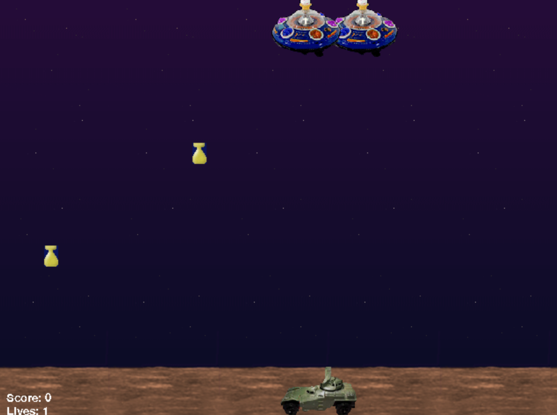
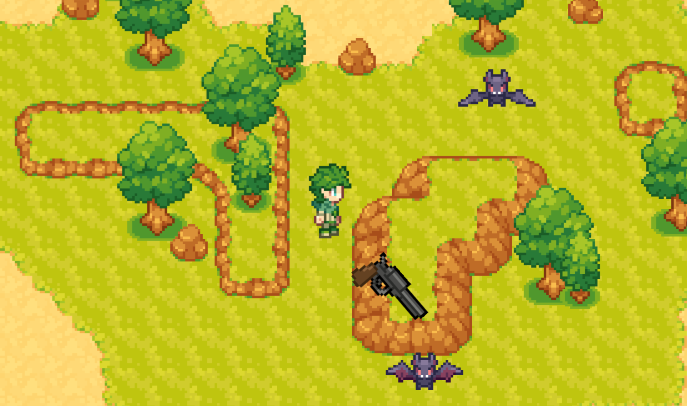

# Aliens Game

Un jeu d'arcade où vous combattez des extraterrestres, conçu en utilisant l'architecture ECS (Entity-Component-System). Le jeu a été développé en Python avec la bibliothèque Pygame pour gérer la logique du jeu et les graphismes.



## Installation

### Prérequis

Avant de pouvoir exécuter le jeu, vous devez installer Python et quelques dépendances. Vous pouvez télécharger Python à partir de [python.org](https://www.python.org/).

### Cloner le dépôt

Vous pouvez cloner ce dépôt Git pour récupérer le code source complet :

```bash
git clone https://github.com/Infinityy1001/AICG-Game.git
cd Second Try
```
### Lancer le jeu

Une fois les dépendances installées, vous pouvez lancer le jeu de deux façons différentes :

1. En exécutant le script Python directement :

    Si vous avez cloné le dépôt, exécutez le jeu en lançant le fichier game.py :
    ```bash
    python aliens_game.py
    ```

2. En utilisant l'exécutable :

    Si vous préférez ne pas exécuter le code Python directement, vous pouvez utiliser l'exécutable aliens_game.exe (disponible dans le répertoire dist). Il vous suffit de double-cliquer dessus pour lancer le jeu.

###  Fonctionnalités

* Le jeu met en place une architecture ECS (Entity-Component-System), ce qui permet de gérer efficacement les entités, les composants et les systèmes du jeu.
* Le joueur contrôle un véhicule de combat (AFV) qui peut se déplacer à gauche et à droite tout en tirant pour détruire des extraterrestres (aliens).
* Les aliens descendent lentement et peuvent lâcher des bombes pour attaquer le joueur.
* Le joueur marque des points pour chaque alien abattu, mais perd des vies lorsqu'il entre en collision avec un alien ou une bombe.
* Le joueur peut récupérer des vies en atteignant certains objectifs, et le jeu continue tant que des vies sont disponibles.

###  Architecture ECS

Le jeu suit l'architecture ECS où :

* Entités : Chaque objet du jeu (alien, véhicule, bombes, etc.) est une entité.
* Composants : Chaque entité est composée de composants qui représentent ses caractéristiques (position, graphismes, vitesse, etc.).
* Systèmes : Les systèmes traitent la logique de jeu, comme le mouvement des objets, les collisions, les animations, etc.

###  Ressources

Le jeu nécessite des ressources graphiques et sonores. Vous pouvez les trouver dans le répertoire data/ du projet.


## Autre jeu - (dans le dossier **First Try**)

Dans le dossier **First Try**, vous trouverez une esquisse de jeu inspirée de **Brawl Stars**, créée en Python. Ce jeu est encore une version très préliminaire, mais il présente des mécaniques de jeu intéressantes, avec des personnages qui peuvent se déplacer et interagir dans un environnement de type arène.



### Fonctionnalités de l'esquisse :
- Mécanique de combat de type arène.
- Personnages avec des mouvements et des attaques simples.
- Interfaces de base pour interagir avec les personnages.


### Lancer le jeu

Une fois les dépendances installées, vous pouvez lancer le jeu de deux façons différentes :

1. En exécutant le script Python directement :

    Si vous avez cloné le dépôt, exécutez le jeu en lançant le fichier game.py :
    ```bash
    python main.py
    ```

2. En utilisant l'exécutable :

    Si vous préférez ne pas exécuter le code Python directement, vous pouvez utiliser l'exécutable main.exe (disponible dans le répertoire dist). Il vous suffit de double-cliquer dessus pour lancer le jeu.

Bien que ce ne soit qu'une esquisse, elle permet de voir une tentative de recréer des éléments de jeux comme **Brawl Stars**, avec une approche plus simple et réalisée en Python.

